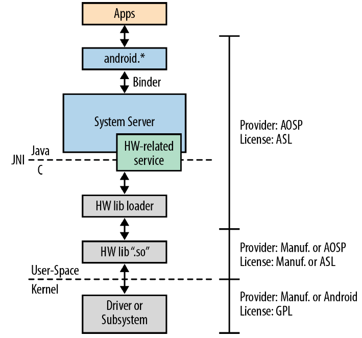

# Android

### Acronyms/Terms:

* HAL = Hardware Abstraction Layer
* AOSP = Android Open Source Project = Android Platform, which runs on the linux kernel.
* Android compatible Linux Kernel
* SoC = System On A Chip
* Dalvik = custom build VM for running Android so it doesn't use proprietary material from Oracle \(Java\)
* Apache Harmony = instead of the official class library, it's a reimplementation of the class lib.
* ABI = Application Binary Interface, which has the CPU instructions sets, endiannes of memory stores and loads at runtime \(Android is little-endian\), format of executable binaries \(Android uses ELF\)
* UID = User Identifier, used kernel for hierarchy access control. In Android each app gets its UID, as if each app would be a different user.
* OOM = undesired state of a computer when no additional memory can be allocated for use by programs or the OS.
* IPC = Inter-Process Comunication
* RTC = Real-Time Clock
* HRT = High-Resolution Timers
* Socket = allows communication between two different process on the same or different machines, usually when speak about sockets we think about internet, i.e: stream sockets, which use TCP \(data is guaranteed to be delivered\) and datagram sockets, which uses UDP \(data isn't guaranteed to be delivered\).
* FHS = File Hierarchy System, is the normal linux organization folder: /bin /boot /dev /etc...

### Linux Kernel

On the folder /boot in Ubuntu, is where the bootloader loads the kernel, the kernel is compressed and named as vmlinuz, if you want to check your kernel: $ uname -a There might be more than one kernel, in case one kernel breaks. To configure and customize our own kernel we have to download it separetely. To know [what is each file in /boot](https://www.linuxquestions.org/questions/linux-newbie-8/%5Bboot%5D-what-do-those-files-do-828407/) . The drivers \(called as modules in Kernel\), which are .c functions that makes interface with the hardware \(CPU and so on\) are located in the /lib/modules folder in Ubuntu.

By configuring the kernel using libncurses5-dev \(which is a text based GUI\) we can easily setup our kernel the way we want, for instance: I want to enable Windows file type system to our kernel, then we can make the change on it and we select if we want to configure the knowledge to be loaded in the kernel only when needed \(M, as module\) or always \(\*\)..

## Chapter 2: Android App Developer's View

The entire Android behavior is predicted on low-memory conditions. Concepts that are important to understand, even though i'm focused on embedded systems. 

#### - Components

There's no main\(\) function in Android apps, applications consist of components and one component from an app can invoke or use component of other apps. Instead of main function, there are predefined events, called intents in which developers can tie their components to, therefore enabling the components to be activated on the occurrence of other events. Example: pressing the Contacts button in the Dialer app opens up the component Contacts.

Types of components:

* Activities: it's like a web browser tab window, but in this case activities can't be resized/maximized/minimized, they always take the entire space, using the back button to navigate through them. One activity can be displayed as an icon on the Android homescreen. A stack of activities is called a task.
* Services: are like daemons in Unix \(background process\). Service is activated when a component requests it.
* Broadcast receiver: interrupt handlers or like trigger event, sensitive to a specific matter.
* Content provider: database for the app. Most content providers rely on SQLite, which is included in Android.

#### - Intents

Allows components to interact. Is a passive object, what matters for the interaction is actually the dispatching \(and its contents\) and the mechanism to dispatch it \(along with system built-in rules etc\). _Example of system rule: intents are tied to the type of the component they are sent to, intent sent by a service can be only received by a service, not by a broadcaster or activity._ 

#### _- Component Lifecycle_

Switching between components \(task\) sometimes can lead to the memory to be full and we have to manage the stack of components, so we have to take down a component so another one that the user is interested can be opened up, but when the user clicks on the taken down component, the previous state \(context\) should be saved as if he never closed it, to make this behavior possible we use component lifecycle, which is basically callbacks for each component.

#### _- Manifest_

The main entry point of an app. Inform the system about the app's components, minimum API level required, HW requirements. It's an XML file \(like in ROS for ROS packages\) and resides on the top of the directory sources. Manifest \(components\) is statically declared \(at build time\), while broadcast receiver can be declared at runtime. _One good example of that is a bluetooth connection, which is estabilished at runtime, although we have to give the permissions about the bluetooth before the application starts._

#### _- Processes and Threads_

When an app's component is activated a process is started. Important to know is that more than one component is run within a single linux proccess, so if we make a long blocking operation on a standard component, we'll be running probably other components because the process is gonna run the other components, so in this case is better to use a Thread for it. \(low-memory conditions mindset\)

#### _- Remote Procedure Call \(RPC\)_

In order to components to communicate with each other, they do not use the traditional socket mechanism, but what is called as _binder_, which is a in-kernel binder mechanism, accessible through _/dev/binder._ But normal Android developers don't use the binder directly, they use the Android's Interface Definition Language \(IDL\). __

#### _- Security and Permissions_

As said in UID acronym, each app gets an UID. The "users"/apps can access other user's data only if granted \(hence iPhone, Android\) structure to ask if they can access your contact list or so. On the other hand, some apps can have the static declaration of access grant in the manifest file, like accessing the camera, location, internet \(sockets\)...

### SDK and NDK

Development: NDK and SDK. Native Development Kit, which CANNOT be confused to be an unlimited Development Kit, it is used mostly for graphics performance \(like games: Angry Birds, for instance\). But it goes indeed one layer down from the Java environment, here we can AS WELL program in C to interface with embedded systems, but it's not the focus, it still has its limitations. C -&gt; Java layer programming. When we want to add new functionality with new hardware then we have to use the NDK. Usually what happens is the programming in C and then when compiling the C code, we target the processor that we want to use \(arm64, for instance\) and then a .so Shared Object will be created, which basically has all functionalities from the c function embedded in a .so file along with the header file, making the code public and available to interface with Java, for example. Since the Android system already communicates properly with the chip, so the Java layer will communicate seamless with the compiled .so. For the supported processors, one has to [check the Android ABIs](https://developer.android.com/ndk/guides/abis).

Think about it: when we rewrite the kernel for a new purpose/ new android, we have to rewrite the SDK as well.

Features/drivers that have been added do the Linux Kernel to androidize \(important to say that those drivers \[at the time of writing of the book 2012 or 2013 maybe\] are located in the `drivers/staging/android`, because they have to be mature in order to be merged on the original kernel tree `drivers` \): 

* Wakelock: functionality that prevents the system going to low-power mode, useful because different from computers, smartphones need to be in an active state.
* Low-Memory Killer: kicks in before the OOM mechanism, the OOM only kicks in really when it's out of memory, but beforehand, Android deals with everything. It's like a swap memory, which is a virtual memory, which swaps to the secondary memory \(HDD\) when the RAM is full, it has a special mapping so the swapping is fast.
* Binder: remembering this is fundamental for components \(more specific: services\) to talk with each other \(RPC\) in the DevApp, which allows in the end apps to talk the System Server, hence what is used to make apps talk with each other. In the Linux philosophy if you want to add a new service, you would need to to implement a new daemon \(process\), with binder we can add remotely invocable objects, meaning we can implement the remote object in any desired language and share the same process space as other services. **Important to say that services used by System Server is not the same service by apps through the service component model, so to disguinsh both we say: service component and service. Services run with system privileges and live from boot to reboot, while service component are life-cycled components associated with the app and their app privileges. But binder interacts with both of them.** 
* Alarm: depends on RTC and HTC. When using HRT, the system cannot be in suspended mode. While with RTC could be used \(hence, the alarm\) even when the system is suspended. Android system makes use of the best of both worlds, by default using HRT to provide alarm for its users, if the system is about to suspend, it switches to RTC at the appropriate time. The alarm driver makes use of wakelock mechanism whenever needed.
* Logger: essential component for any Linux system, being able to analyze errors and warnings in real time or postmortem. `dmesg` is one of the logging system and the system logs, which are found in the `/var/log` directory. The kernel's log contains messages printed out by `printk()` made in kernel and from the drivers. From what i understood, Android uses the logger the way it is but customizes its own logging mechanisms, which differs a lot from the syslog standard way. _No task-switch or file-writes are required for logging, instead it uses a circular buffer in RAM where it logs every incoming event and returns immediately back to the caller. Note: standard syslog sends messages through sockets and generates a task switch, using files to store its information. **It's crucial for mobile devices to have a log that doesn't grow indefinitely \(because it takes too much memory\), moreover those systems usually rely on SSDs, which have a limited number of erase cycles, so avoiding superfluous writing is crucial, that's why the ring buffer works like a charm.**_
* Paranoid Networking: in Linux all processes are allowed to create sockets to communicate with the network, but since Android's security model, an app's network access has to be controlled, therefore there's an option for the process if it belongs to a certain group/with certain capabilities, this can be applied to IPv4, Ipv6 and Bluetooth.

### Hardware Support

Android's Hardware Abstraction Layer:

Although android is built on the kernel's hardware abstractions and capabilities \(drivers, as we've seen above\), its subsystems and libraries doesn't rely on the standard /dev entities, instead Android relies on shared libraries provided by manufactures to interact with the hardware \(HAL\). _As seen on the figure above, the Android still relies on the drivers from kernel that we've spoken, but the interfacing with the hardware is done through the shared libraries._ 

### Native User Space

### Filesystem layout

 sinal de que é possível hostear Android lado a lado com uma distribuição Linux no mesmo sistema raiz de arquivos: pois os diretórios principais do android são /system e /data e que não emanam do Filesystem Hieracyh Standard \(bin, boot, dev...\):

* /system é gerado pelo build do AOSP \(imutável\), montado na read-only memo
* /data é pra guardar dados gerados por apps ou instalados pelo usuario, at runtime \(read-write mode\)

### Init

Is a daemon process that runs from start until the computer has been shut off, hence is  the father of all other processes, which is way its PID \(Process Identifier\) is 1. Linux systems back then used to use the SystemV init process, which has moved to Upstart in Ubuntu and systemd in Debian and in embedded linux systems the init process that is used is the BusyBox. The kernel boot process on Android is the same as in linux, what changes is when the boot process finishes.

This tweaking is made on the /init.rc and /init.&lt;device-name&gt;.rc, there one has a high degree of control over the system's startup behavior, it's possible to disable the Zygote process \(which inherits its name from the cell proces, the initial cell formed when a new organism is produced, i.e: handles the forking of each new application process, so new applications are always forked from Zygote \(preloads Java classes, resourcers, starts System Server, opens sockets...\)

### Toolbox

Toolbox \(BSD Licensed\), Busybox is unix tools unidas em um arquivo executável, importante pra sistemas embarcados que usam linux \(low memory resources\), embedded linux. temos todos os benefícios das ferramentas \(cd, cat, mkdir, grep, pwd, wget, ping...\), usado também no Alpine Linux \(usado pra Docker, com imagens menores\) e no init antes de realmente carregar todo o sistema operacional.

A vantagem do BSD é que tem incentivo da comercialização, já o GPL não. Inclusive pode ser usado BSD dentro de codigo GPL, o reverso não.

### System Startup

CPU fetches a suas instruções iniciais em um endereço fixo hardcoded, tal endereço aponta pra um chip que tem o bootloader, o bootloader inicializa a RAM, coloca o hardware em um estado quiescente, loada o kernel and o disco de RAM e depois vai pro kernel. \(tenta\)

## Chapter 3: AOSP

Remembering the AOSP is built on the Linux kernel, so it's a layer on top of it before interfacing with the Java layer. Maintained in Git, we use the tool repo to fetch and manage AOSP. repo init, repo sync, repo fetch

There's a directory called /devices which is going to contain all the supported devices by AOSP, this is where the vendor put its own developed part, the rest of the tree is the same for everyone.

Hardware: HAL 

Packages: basically the main and native apps from Android: E-mail, Calculator and so on... 

System/systemcore: forms the basis of the embedded linux system where the Android is being built \(there you find the adb, init, liblog, logcat,  shell\)

